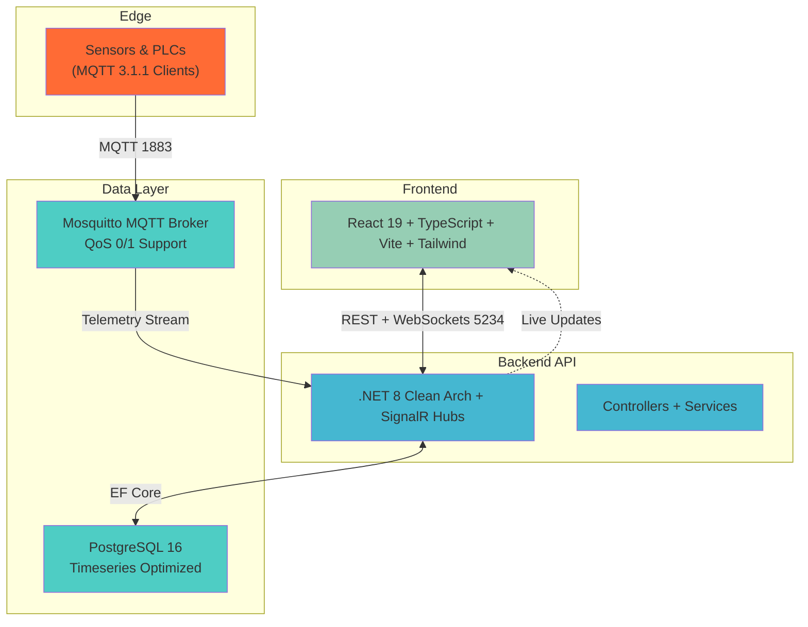

# 🏭 Industrial IoT Asset Monitoring & Predictive Dashboard

## 📂 Core Capability Overview
**Industrial IoT Core** is a sophisticated, enterprise-grade asset intelligence platform designed for the complex demands of the **Oil & Gas (O&G)** and heavy manufacturing sectors. It serves as the "Command Center" for industrial facilities, bridging the gap between raw edge sensor data and high-stakes operational decision-making.

### What is this software?
This system is an end-to-end monitoring solution that orchestrates:
- **High-Frequency Ingestion**: Captures real-time telemetry (Temperature, Pressure, Vibration) from dispersed hardware nodes via MQTT protocol.
- **Predictive Health Analytics**: Analyzes incoming data streams to identify surging trends and threshold violations before they lead to critical equipment failure.
- **Enterprise-Grade Visualization**: A high-density "Industrial Light" dashboard designed for mission-critical operations centers, providing both a "Bird's-eye view" of global fleet health and granular "Node-level" management.
- **Real-time Synchronization**: Uses secure Bidirectional handshakes (SignalR) to ensure field operators and remote managers see identical state data with sub-second latency.

Built with a "Secure by Design" mindset and structured using Domain-Driven Design (Clean Architecture).

## 🏗️ Industrial Standards & Business Value

This platform is built to align with modern **Industry 4.0** requirements, ensuring it is more than just a dashboard—it's an enterprise-grade asset intelligence framework.

### 💎 Why This System?
- **Predictive Maintenance**: By identifying threshold violations in real-time, facilities can transition from costly *Reactive* maintenance to efficient *Predictive* maintenance, saving millions in potential downtime.
- **Unified Command Center**: Centralizes data from heterogeneous hardware (Pumps, Motors, Compressors) into a single, high-fidelity source of truth.
- **Operational Safety**: Remote monitoring reduces the need for human personnel to perform manual checks in high-risk industrial zones.

### 🛠️ Real-World Standards
- **Global MQTT Standard**: Utilizes **ISO/IEC 20922 (MQTT)**, the gold standard for lightweight, reliable industrial messaging.
- **Enterprise Architecture**: Implements **Clean Architecture** and **Domain-Driven Design (DDD)**, ensuring the codebase is modular, testable, and ready for long-term evolution.
- **High-Frequency Sync**: Leverages **SignalR (WebSockets)** for sub-second data synchronization, critical for mission-control environments.

---

## 🌍 Real-World Enterprise Applications (Industry 4.0)

While technically a software platform, this system acts as a middleware and "Command Center" (SCADA / MES hybrid) connecting physical heavy-machinery to human operators. 

### 🛢️ Oil & Gas (O&G)
- **Use Case**: Monitoring offshore drilling rigs, pipeline pressures, and extraction pumps. 
- **Value**: If pressure drops unexpectedly across a pipeline, the Command Center instantly identifies potential leakages in real-time, directing field engineers to the exact node securely.

### ⚙️ Heavy Manufacturing
- **Use Case**: Supervising continuous production lines, CNC machines, furnaces, and heavy-duty conveyor belts.
- **Value**: Vibration and temperature telemetry feed directly into Predictive Maintenance workflows. If an engine begins to vibrate abnormally, it triggers a warning to schedule weekend maintenance *before* an unplanned breakdown halts the assembly line (saving millions in downtime).

### ⚡ Power Plants & Utilities
- **Use Case**: Monitoring thermal output for steam turbines, generators, and transformers in substations.
- **Value**: Prevents catastrophic overheating events. Live temperature streams automatically evaluate limits and issue *Critical* warnings.

### 👥 Primary User Personas
- **Control Room Operators**: Monitors the primary live Dashboard to maintain 100% facility situational awareness.
- **Reliability Engineers**: Utilizes the `Asset Digital Twin` routing to analyze historical telemetry graphs and trend-lines.
- **Plant Managers**: Assess aggregated health indexes to maintain equipment lifecycle efficiency.

---


## 🛠️ Tech Stack

- **Backend:** .NET 8 Web API (Clean Architecture)
- **Frontend:** React + Vite + TypeScript + Tailwind + Shadcn UI
- **Database:** PostgreSQL (Relational & Time-Series Data)
- **Messaging Protocol:** Eclipse Mosquitto (MQTT Broker)
- **Real-time Comm:** SignalR (WebSockets)
- **Infrastructure:** Docker Compose (Containerized Infra)

## 🏛️ System Component Architecture



## 📂 Repository Structure

This project follows a monorepo approach:

```text
/industrial-iot
├── /apps                  # Frontend applications
│   └── /web-dashboard     # React SPA for monitoring
├── /scripts               # Edge simulation & utility scripts
│   └── mqtt-telemetry-simulator.js # Mock telemetry generator
├── /infra                 # Containerized infrastructure (DB, MQTT)
│   └── docker-compose.yml
└── /server                # Backend .NET Solution
    ├── /IndustrialIot.Domain         # Enterprise logic & Entities
    ├── /IndustrialIot.Application    # Use cases & DTOs
    ├── /IndustrialIot.Infrastructure # EF Core & MQTT persistence
    └── /IndustrialIot.Api            # Controllers & SignalR Hubs


## 🚀 Getting Started (Local Development)

### 1. Prerequisites
- Docker Desktop
- .NET 8 SDK
- Node.js 18+ & pnpm
- Git

### 2. Clone & Infrastructure
```bash
git clone https://github.com/athallaarl66/industrial-iot.git
cd industrial-iot

# Setup Environment
cp infra/.env.example infra/.env  # Update DB_PASSWORD in .env

# Start Infrastructure (Postgres 5433 + MQTT Broker)
cd infra
docker compose up -d
```
> [!NOTE]
> The local PostgreSQL database is mapped to port **5433** to avoid collision with default local instances.

### 3. Backend (.NET API + DB)

```bash
cd server
dotnet ef database update  # from IndustrialIot.Api dir
dotnet run --project IndustrialIot.Api  # https://localhost:7053/swagger
```

**Test Alerts:** `GET /api/v1/alerts?count=10`

### 4. Frontend (Dashboard)

```bash
cd apps/web-dashboard
pnpm install
pnpm dev  # http://localhost:5173
```

### 5. Test Full Stack (Generate Telemetry + Alerts)

```bash
node scripts/mqtt-telemetry-simulator.js  # creates alerts automatically
```

---

---

## 📖 Operating Guide & Tutorials
To get the most out of the **Industrial IoT Core** platform, we have provided a comprehensive usage guide:

👉 **[Read the full Operating Guide & Tutorial here](docs/OPERATING_GUIDE.md)**

This guide covers:
1. **Provisioning** industrial hardware assets.
2. **Generating** real-time telemetry via the edge simulator.
3. **Monitoring** system health from the Command Center.
4. **Decommissioning** nodes securely.

---

### 6. Verify System Integrity
Once everything is running, you can verify the status via:
- **Dashboard**: Check `http://localhost:5173/assets` for live SignalR updates.
- **API Swagger**: Check `https://localhost:7053/swagger` for alert endpoints.
- **Database**: 
  ```bash
  docker exec -it infra_db_1 psql -U iot_admin -d industrial_iot_db -c "SELECT * FROM \"Alerts\" LIMIT 5;"
  ```

---

## 🔒 Security & Best Practices
- **Zero Trust MQTT**: All hardware nodes must authenticate via the MQTT broker.
- **Environment Management**: Use `.env` for all secrets; never commit sensitive data to version control.
- **API Validation**: Strict `FluentValidation` implemented on all command/query models.
- **Data Efficiency**: EF Core `Includes` and projections are used to prevent N+1 performance bottlenecks.

---

## 🌿 Git Flow & Contribution
This project follows strict branching strategies to maintain stability:

- **main**: Production-ready code. Direct commits are restricted.
- **develop**: Integration branch for upcoming features.
- **feat/* **: Dedicated branches for new features (e.g., `feat/mqtt-ingestion`).
- **fix/* **: Dedicated branches for bug resolution (e.g., `fix/handshake-loop`).

*Please create a Pull Request (PR) against the `develop` branch for any proposed changes.*
