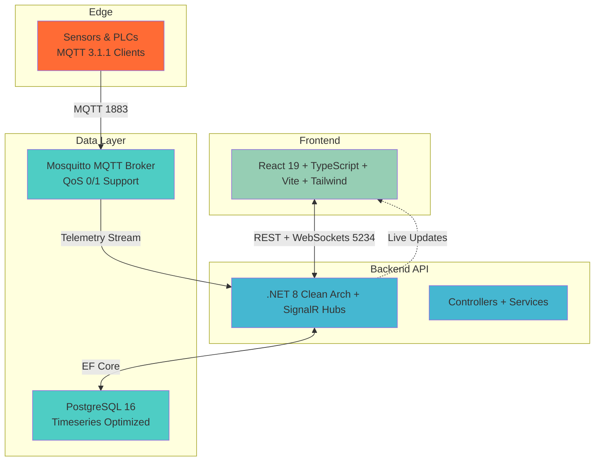
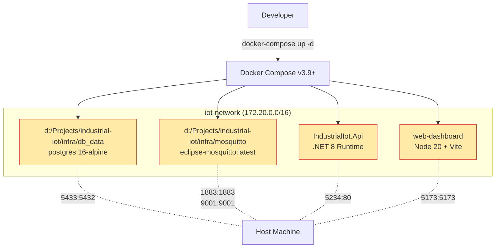
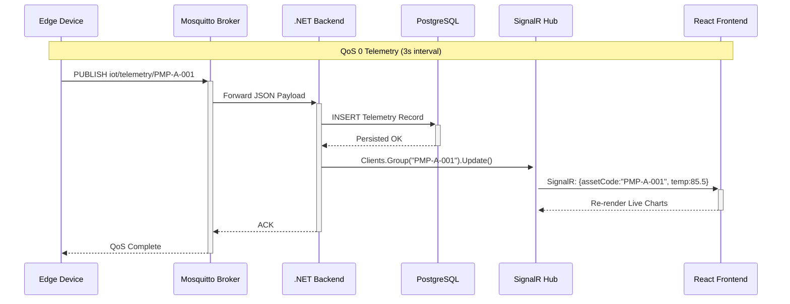

# Architecture Decision Records (ADR)

## Overview

This document contains architecture decisions made for the Industrial IoT Asset Monitoring System. Each decision follows the standard ADR format with context, decision, and consequences.

---

## ADR-001: PostgreSQL vs MongoDB for Time-Series Data

### Status

**Accepted**

### Context

The system must handle high-frequency telemetry data (10,000+ messages/second) with complex relationships between assets, sensors, and historical data. Need to choose a database that can handle time-series queries efficiently while maintaining data integrity.

### Decision

**Chosen: PostgreSQL with EF Core**

### Rationale

- **ACID Compliance:** Guaranteed data consistency for critical industrial data
- **Relationship Support:** Complex queries between Assets, Telemetry, Alerts
- **Indexing Strategy:** Powerful indexing for time-based queries
- **Mature Ecosystem:** Extensive tooling and community support
- **Cost:** No licensing costs, well-optimized open-source solution
- **Skill Alignment:** Fits .NET ecosystem with EF Core

### Alternatives Considered

- **MongoDB:**
  - Pros: Schema flexibility, good for time-series data
  - Cons: Less mature transaction support, higher learning curve
- **InfluxDB:**
  - Pros: Specialized for time-series data, excellent performance
  - Cons: No relationship support, separate from main application database
- **TimescaleDB:**
  - Pros: PostgreSQL extension for time-series, best performance
  - Cons: Additional complexity, migration path less clear

### Consequences

- **Positive:**
  - Enterprise-grade data integrity with ACID compliance
  - Seamless integration with EF Core and .NET ecosystem
  - Strong query capabilities for complex business logic
  - Well-supported tooling for monitoring and optimization
- **Negative:**
  - Time-series performance may degrade with very large datasets
  - Manual optimization required for high-frequency writes
  - Future migration to TimescaleDB possible if performance issues arise

### Monitoring

- Monitor database query performance for time-series queries
- Track index usage and effectiveness
- Monitor database size growth and plan partitioning if needed
- Consider TimescaleDB migration if performance degrades

---

## ADR-002: MQTT vs HTTP for Telemetry Ingestion

### Status

**Accepted**

### Context

Industrial IoT system needs reliable, low-latency communication for real-time sensor data from edge devices. Communication method affects system performance, reliability, and infrastructure complexity.

### Decision

**Chosen: MQTT with Eclipse Mosquitto Broker**

### Rationale

- **Low Latency:** Minimal overhead for real-time communication
- **Bandwidth Efficient:** Small packet headers ideal for IoT devices
- **Quality of Service:** Configurable delivery guarantees (QoS levels)
- **Publish-Subscribe:** One-to-many communication pattern
- **Offline Support:** Retained messages and Last Will Testament
- **IoT Standard:** Widely adopted in industrial IoT applications
- **Scalable:** Broker can handle thousands of concurrent connections

### Alternatives Considered

- **HTTP REST API:**
  - Pros: Well-understood, widely supported, easy to implement
  - Cons: Higher latency, heavier bandwidth, no push mechanism
- **WebSockets:**
  - Pros: Full-duplex communication, lower latency than HTTP
  - Cons: More complex infrastructure, no built-in broker features
- **CoAP (Constrained Application Protocol):**
  - Pros: Designed for constrained devices, UDP support
  - Cons: Less mature ecosystem, fewer libraries

### Consequences

- **Positive:**
  - Excellent performance for high-frequency sensor data
  - Natural fit for one-to-many device communication
  - Built-in features for IoT scenarios (QoS, retained messages, LWT)
  - Lightweight implementation with low bandwidth usage
- **Negative:**
  - Additional infrastructure complexity (broker management)
  - Requires learning MQTT protocol and best practices
  - Less familiar to traditional web developers

### Implementation Notes

- Broker security configuration critical (authentication, TLS)
- Quality of Service (QoS) levels appropriate per use case
- Reconnection strategy needed for device reliability
- Message validation required at backend

### Future Considerations

- MQTT v5 adoption for advanced features
- Broker clustering for high availability
- Integration with enterprise message brokers (IBM MQ, Azure IoT Hub)

---

## ADR-003: Clean Architecture vs Traditional Layered

### Status

**Accepted**

### Context

Building an enterprise-grade system that requires maintainability, testability, and flexibility for future growth. Need to choose an architectural pattern that supports these requirements while balancing development complexity.

### Decision

**Chosen: Clean Architecture with Domain-Driven Design**

### Rationale

- **Separation of Concerns:** Clear boundaries between business logic, data access, and presentation
- **Testability:** Each layer can be tested in isolation with mocks
- **Maintainability:** Business logic independent of frameworks and databases
- **Flexibility:** Easy to replace implementations without affecting core business rules
- **Enterprise Standard:** Proven in large-scale enterprise applications
- **Domain Focus:** Business rules captured in domain layer, not technical details
- **Scalability:** Natural separation allows independent scaling of components

### Layer Structure

```
┌─────────────────────────────────────────────────┐
│         API Layer (Presentation)           │
│  Controllers, SignalR Hubs, DTOs        │
├─────────────────────────────────────────────────┤
│      Application Layer (Use Cases)          │
│  Services, Interfaces, Validation          │
├─────────────────────────────────────────────────┤
│     Infrastructure Layer (Implementation)     │
│  EF Core, MQTT, External Services          │
├─────────────────────────────────────────────────┤
│       Domain Layer (Business Logic)          │
│  Entities, Enums, Value Objects            │
└─────────────────────────────────────────────────┘
```

### Alternatives Considered

- **Traditional N-Tier:**
  - Pros: Simpler initial setup, easier for junior developers
  - Cons: Tight coupling, harder to test, less flexibility
- **Onion Architecture:**
  - Pros: Similar benefits to Clean Architecture
  - Cons: More complex dependency rules, less common
- **Hexagonal Architecture:**
  - Pros: Clear separation of concerns, ports and adapters
  - Cons: More abstract, harder to understand initially

### Consequences

- **Positive:**
  - Highly maintainable codebase with clear boundaries
  - Excellent testability with isolated unit tests
  - Business logic protected from framework changes
  - Easy to swap database implementations or add new features
  - Natural fit for Domain-Driven Design principles
- **Negative:**
  - Initial setup more complex than traditional layered
  - More boilerplate code for interfaces and registrations
  - Steeper learning curve for junior developers
  - May feel like over-engineering for simple features

### Best Practices

- Domain layer remains framework-agnostic
- Dependencies always point inward (toward domain)
- Use dependency injection for layer coupling
- Business logic stays in domain/application layers
- Infrastructure implements interfaces from application layer

---

## ADR-004: React vs Vue.js for Frontend

### Status

**Accepted**

### Context

Building an enterprise-grade dashboard for real-time IoT data visualization. Need a modern frontend framework that supports component-based architecture, real-time updates, and has strong ecosystem support.

### Decision

**Chosen: React 19 with TypeScript**

### Rationale

- **Large Ecosystem:** Extensive library support for charts, components, utilities
- **TypeScript Integration:** Excellent support for type-safe development
- **Performance:** Virtual DOM and recent optimizations for efficient rendering
- **Real-time Updates:** Efficient handling of frequent UI updates (sensor data)
- **Industry Standard:** Widely adopted in enterprise environments
- **Developer Experience:** Strong tooling (Vite, React DevTools, etc.)
- **Career Growth:** Strong alignment with current job market demands

### Alternatives Considered

- **Vue.js 3:**
  - Pros: Simpler learning curve, excellent performance, smaller bundle size
  - Cons: Smaller ecosystem, fewer enterprise examples
- **Angular:**
  - Pros: Enterprise-grade framework, strong structure, TypeScript-first
  - Cons: Steeper learning curve, more complex initial setup
- **Svelte/SvelteKit:**
  - Pros: Excellent performance, smaller bundles, simpler code
  - Cons: Smaller ecosystem, less enterprise adoption

### Consequences

- **Positive:**
  - Excellent real-time performance for live sensor data
  - Large component ecosystem for rapid development
  - Strong type safety with TypeScript
  - Extensive documentation and community support
  - Strong career prospects and learning resources
- **Negative:**
  - Larger bundle size compared to some alternatives
  - More boilerplate than some modern frameworks
  - Need to manage dependencies carefully to avoid bloat

### Implementation Considerations

- Use functional components and hooks (modern React patterns)
- Implement proper state management (consider Redux/Zustand if needed)
- Optimize re-renders for high-frequency updates
- Use TypeScript for all components and utilities

---

## ADR-005: Vite vs CRA (Create React App)

### Status

**Accepted**

### Context

Need a build tool and development server that supports modern frontend development practices with fast iteration and optimized production builds.

### Decision

**Chosen: Vite**

### Rationale

- **Fast Development:** Lightning-fast HMR (Hot Module Replacement)
- **Modern Build:** Optimized production builds with excellent performance
- **Simple Configuration:** Minimal setup, opinionated defaults
- **Extensible:** Plugin system for custom functionality
- **Native ESM:** Uses native ES modules, better than CRA
- **Performance:** Faster initial start and build times
- **Active Development:** Actively maintained and improved

### Alternatives Considered

- **Create React App (CRA):**
  - Pros: Official tooling, zero-config setup, well-documented
  - Cons: Slower builds, larger bundles, less customizable
- **Next.js:**
  - Pros: Full-stack framework with SSR, excellent performance
  - Cons: Over-engineered for single-page dashboard, more complexity
- **Webpack (custom):**
  - Pros: Maximum customization, control over everything
  - Cons: Complex configuration, steep learning curve

### Consequences

- **Positive:**
  - Excellent development experience with fast hot reloading
  - Optimized production builds for better performance
  - Easy configuration with sensible defaults
  - Active community and frequent updates
- **Negative:**
  - Less mature than CRA (though rapidly improving)
  - Need to learn Vite-specific configurations
  - Some plugins may not be as mature as Webpack

### Performance Impact

- Faster iteration during development (5-10x faster HMR)
- Smaller production bundles due to better tree-shaking
- Better development experience with near-instant updates

---

## ADR-006: SignalR vs Polling for Real-time Updates

### Status

**Accepted**

### Context

Dashboard needs real-time updates from IoT devices (telemetry data, alerts, system status). Need a real-time communication mechanism that's efficient and reliable.

### Decision

**Chosen: ASP.NET Core SignalR**

### Rationale

- **Real-time Performance:** Efficient WebSocket-based communication
- **Automatic Reconnection:** Handles network interruptions gracefully
- **Server-Sent Events:** Automatic fallback if WebSockets unavailable
- **Type Safety:** Strongly-typed client and server code
- **Built-in Features:** Connection management, groups, broadcasting
- **Integration:** Seamless integration with ASP.NET Core
- **Scalability:** Can be scaled with Redis backplane (future)
- **Enterprise Ready:** Used in production by many large companies

### Alternatives Considered

- **HTTP Polling:**
  - Pros: Simple implementation, works everywhere
  - Cons: High server load, latency, wasted bandwidth
- **Raw WebSockets:**
  - Pros: Full control over protocol, widely supported
  - Cons: Manual reconnection, no built-in features
- **Server-Sent Events (SSE):**
  - Pros: Simpler than WebSockets, browser-native
  - Cons: One-way only, no automatic reconnection
- **Socket.io:**
  - Pros: Excellent features, browser compatibility
  - Cons: Additional complexity, not integrated with ASP.NET

### Consequences

- **Positive:**
  - Excellent real-time performance with low latency
  - Automatic handling of connection issues
  - Strong type safety reduces bugs
  - Easy to implement group-based messaging
  - Natural fit with existing .NET architecture
- **Negative:**
  - Requires WebSocket support (most modern browsers support it)
  - Additional complexity compared to simple HTTP
  - Scaling requires Redis backplane for multiple servers

### Implementation Considerations

- Use connection groups for targeted messaging
- Implement robust error handling for connection issues
- Plan for JWT authentication with SignalR
- Consider connection limits and management
- Monitor SignalR performance and connection quality

---

## ADR-007: FluentValidation vs Data Annotations

### Status

**Accepted**

### Context

Need input validation system that's powerful, maintainable, and follows enterprise best practices. Validation is critical for "Zero Trust" security approach.

### Decision

**Chosen: FluentValidation**

### Rationale

- **Separation of Concerns:** Validation logic separate from domain entities
- **Rule Reusability:** Validation rules can be reused across DTOs
- **Complex Rules:** Support for advanced validation scenarios
- **Testability:** Easy to unit test validation logic
- **Integration:** Seamless integration with ASP.NET Core
- **Enterprise Standard:** Widely adopted in enterprise .NET applications
- **Zero Trust:** Server-side validation (not relying on client-side only)

### Alternatives Considered

- **Data Annotations:**
  - Pros: Built-in, simple for basic validation
  - Cons: Limited functionality, tied to entities, less flexible
- **Manual Validation:**
  - Pros: Full control, no dependencies
  - Cons: Code duplication, harder to maintain, less testable
- **Custom Validation Attributes:**
  - Pros: Reusable, can be applied via attributes
  - Cons: Still limited functionality, attribute-based approach

### Consequences

- **Positive:**
  - Flexible and powerful validation capabilities
  - Clean separation from business logic
  - Easy to test and maintain
  - Support for complex validation scenarios
  - Better security with comprehensive server-side validation
- **Negative:**
  - Additional dependency to manage
  - More verbose than data annotations
  - Steeper learning curve than simple attributes

### Best Practices

- Create separate validators for each DTO
- Use descriptive error messages
- Test all validation rules
- Keep validation logic separate from business logic
- Use FluentValidation integration with ASP.NET Core

---

## ADR-008: Docker Compose vs Individual Containers

### Status

**Accepted**

### Context

Need a development and deployment strategy that's consistent, reproducible, and easy to manage across different environments.

### Decision

**Chosen: Docker Compose with Multi-Container Orchestration**

### Rationale

- **Consistency:** Same environment across development and production
- **Simplified Management:** Single command to start/stop all services
- **Networking:** Automatic network configuration between containers
- **Volume Management:** Easy data persistence and sharing
- **Service Discovery:** Automatic service resolution by container name
- **Development Friendly:** Easy setup for new team members
- **Production Ready:** Can be adapted for production deployment

### Alternatives Considered

- **Individual Docker Containers:**
  - Pros: More control over individual containers
  - Cons: Complex networking, manual volume management, harder to reproduce
- **Kubernetes:**
  - Pros: Enterprise-grade orchestration, scaling, self-healing
  - Cons: Over-engineering for current needs, complex learning curve
- **Manual Setup:**
  - Pros: No container overhead, simple for single developer
  - Cons: Environment inconsistencies, hard to reproduce, setup complexity

### Consequences

- **Positive:**
  - Reproducible development environment
  - Easy team onboarding
  - Simplified service networking and dependencies
  - Automatic service startup and shutdown
  - Easy volume management for data persistence
  - Portable across different machines
- **Negative:**
  - Additional complexity compared to manual setup
  - Learning curve for Docker and Docker Compose
  - Resource overhead for containerization

### Implementation Considerations

- Use multi-stage Dockerfiles for optimization
- Configure proper networking between services
- Implement volume persistence for databases
- Use environment variables for configuration
- Document container dependencies clearly

---

## ADR-009: UTC vs Local Time for Timestamps

### Status

**Accepted**

### Context

Industrial IoT system operates globally with assets in different time zones. Need consistent timestamp handling for data accuracy and synchronization.

### Decision

**Chosen: UTC for all timestamps, convert to local in presentation layer**

### Rationale

- **Consistency:** All data stored in UTC for consistency
- **Time Zone Agnostic:** No issues with daylight saving time changes
- **Comparison:** Easy to compare events across different time zones
- **Sorting:** Natural sorting by timestamp works correctly
- **Database Performance:** Indexing works consistently
- **Industry Standard:** Recommended practice for distributed systems
- **Localization:** Display in user's local time at presentation layer

### Alternatives Considered

- **Local Time Storage:**
  - Pros: Simple for single time zone systems
  - Cons: Complex for multi-zone systems, DST issues
- **Database Time Zone:**
  - Pros: Storage in local time with conversion
  - Cons: Complex to manage, database-specific implementation

### Consequences

- **Positive:**
  - Consistent timestamp handling across all systems
  - No issues with time zone changes
  - Easy data comparison and sorting
  - Industry-standard approach
  - Flexible presentation based on user location
- **Negative:**
  - Need conversion logic in presentation layer
  - Need to track user's preferred time zone
  - Debugging requires UTC time understanding

### Implementation Considerations

- All database timestamps stored in UTC
- Client-side conversion to user's local time
- Store original timestamp from IoT device (also UTC)
- Display time zone information in UI
- Consider time zone in user preferences

---

## ADR-010: Swagger/OpenAPI vs API Blueprint

### Status

**Accepted**

### Context

Need API documentation that's automatically generated, maintainable, and provides interactive testing capabilities for developers and external consumers.

### Decision

**Chosen: Swagger/OpenAPI with Swashbuckle**

### Rationale

- **Auto-Generated:** Documentation stays in sync with code
- **Interactive UI:** Built-in testing interface (Swagger UI)
- **Type Safety:** Reflects actual C# types and structure
- **Industry Standard:** OpenAPI specification is widely adopted
- **Client Generation:** Can generate client libraries for multiple languages
- **Integration:** Seamless with ASP.NET Core and Swashbuckle
- **Developer Friendly:** Reduces documentation maintenance burden

### Alternatives Considered

- **API Blueprint:**
  - Pros: Simple syntax, tooling support
  - Cons: Less automatic integration, requires manual updates
- **Manual Documentation (Markdown):**
  - Pros: Full control over presentation
  - Cons: Manual maintenance, easily becomes outdated
- **Postman Collections:**
  - Pros: Excellent testing capabilities
  - Cons: Not generated from code, manual maintenance

### Consequences

- **Positive:**
  - Always up-to-date with code changes
  - Interactive testing interface for developers
  - Industry-standard format for API consumers
  - Can generate client libraries automatically
  - Minimal documentation maintenance overhead
- **Negative:**
  - Customization requires additional configuration
  - May not cover all documentation needs
  - UI limited to standard Swagger interface

### Implementation Considerations

- Enable XML documentation comments in project
- Use proper `[ProducesResponseType]` attributes
- Provide request/response examples
- Document authentication requirements
- Maintain clear and concise endpoint descriptions

---

## ADR-011: Infrastructure System Architecture Standards

### Status

**Accepted**

### Context

The system requires standardized infrastructure architecture for development, deployment, and scaling. Docker Compose provides multi-container orchestration, but needs visual standards and best practices documentation for enterprise deployment.

### Decision

**Docker Compose Multi-Container Architecture with Mermaid Diagrams**

### Rationale

- **Reproducibility**: `docker-compose up` launches full stack.
- **Isolation & Networking**: Internal Docker network for service communication.
- **Persistence**: Volumes for PostgreSQL data and MQTT persistence.
- **Visualization**: Mermaid diagrams for instant comprehension.
- **Production Path**: Basis for Kubernetes migration.

### System Component Architecture



### Docker Compose Deployment Standards



### Real-Time Data Flow (E2E)



### Alternatives Considered

- **Kubernetes**: Enterprise scaling but overkill for MVP.
- **Manual Scripts**: Fast but non-reproducible.
- **Helm Charts**: Complex for local dev.

### Consequences

**Positive:**

- Visual standards accelerate onboarding.
- Single-command reproducible environments.
- Clear scaling path (Redis → K8s).

**Negative:**

- Docker overhead (~2GB RAM local).
- Volume management discipline required.

### Standards

```
NETWORK: iot-network
PORTS:
  - API: 5234
  - PG: 5433
  - MQTT: 1883/9001
VOLUMES:
  - pgdata: /infra/db_data
  - mqtt: /infra/mosquitto/{config,data,log}
```

### Future Evolution

- Redis Sentinel for SignalR scale-out.
- Kubernetes manifests from Compose.
- Terraform for cloud infra.

---

## Decision Review Process

### Criteria for Architecture Decisions

1. **Business Alignment:** Supports business requirements and user needs
2. **Technical Excellence:** Follows industry best practices
3. **Maintainability:** Long-term sustainability and evolution
4. **Performance:** Meets performance requirements
5. **Scalability:** Supports future growth
6. **Team Skills:** Aligns with team capabilities and learning goals

### Decision Updates

- **Status:** Decisions can be revised if context changes
- **Documentation:** Update ADR if implementation differs significantly
- **Review:** Review decisions periodically as system evolves
- **Deprecation:** Mark deprecated decisions clearly

---

_Last Updated: 2026-04-15_
_Documentation Version: 1.0_
